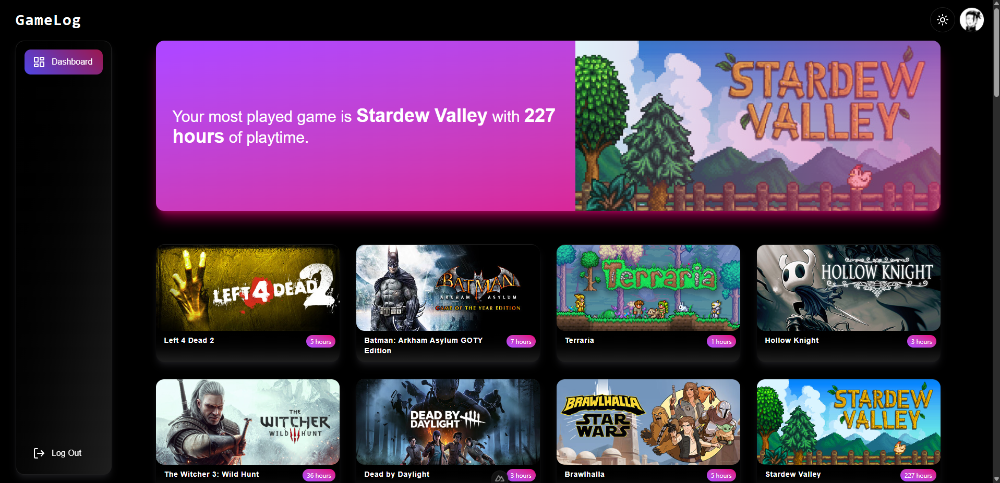

# 🎮 Game Log

**Game Log** is a web application built with **Nuxt 3**, **TailwindCSS**, and **TypeScript**, designed to help you visually track the games you've played, are currently playing, or plan to play. It's a clean and responsive tool to manage your personal gaming backlog.

🟢 **Live demo**:
👉 [https://game-log-sage.vercel.app](https://game-log-sage.vercel.app)

---

## 🚀 Tech Stack

- [Nuxt 3](https://nuxt.com/)
- [Vue 3 + Composition API](https://vuejs.org/)
- [TypeScript](https://www.typescriptlang.org/)
- [TailwindCSS](https://tailwindcss.com/)
- [Pinia](https://pinia.vuejs.org/)
- [Vite](https://vitejs.dev/)

---

## ✨ Features

- 🎮 Game list with cover art and key information
- 🔍 Individual game detail page
- 🌓 Light/Dark mode support
- 📱 Fully responsive design
- ⚡ Optimized performance (SSR, lazy loading)
- 🛠️ Scalable base for authentication and advanced features

---

## 🚧 Roadmap

- [ ] Quick filters by genre, platform, and status
- [ ] Persistent favorites
- [ ] Backend integration
- [ ] PWA support (offline mode)

---

## 📄 License

This project is licensed under the MIT License.
Developed with ❤️ by [Fernando Liévano](https://github.com/fernandolievano)
